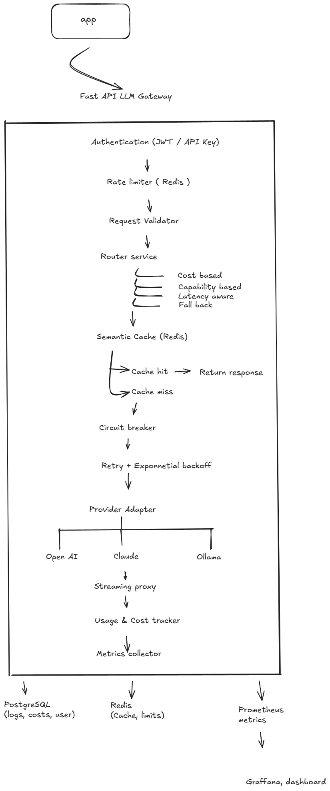
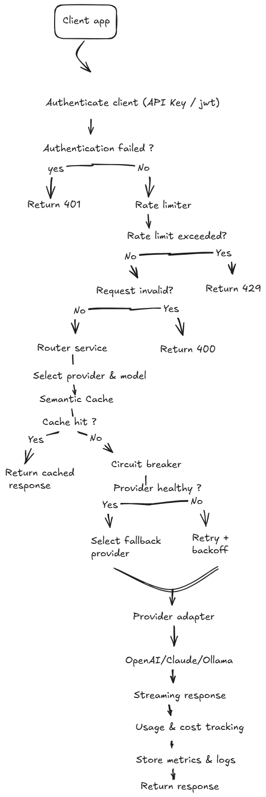

# RouteLLM (LLM Gateway) - System Design
## Problem Statement

Modern applications often rely on a single LLM provider, making them vulnerable to provider outages, rate limits, vendor lock-in, and unpredictable inference costs. Integrating multiple LLM providers directly into an application also increases development complexity, as each provider exposes different APIs, authentication methods, and capabilities. RouteLLM addresses these challenges by providing a unified interface for multiple LLM providers while handling intelligent routing, caching, rate limiting, cost tracking, and automatic failover, enabling applications to remain reliable, cost-efficient, and provider-agnostic.

## Goals
### Functional Goals
- Provide a unified API for multiple LLM Providers
- Support intelligent provider routing
- Reduce inference cost through semantic caching
- Improve availability using automatic provider failover
- Enforce per user rate limits
- Track usage, token consumption and inference costs

### Architectural Goals
- Abstract provider specific APIs behind a common interface
- Allow new providers to add with minimal code changes
- Maintain a modular and extensible architecture
- Expose a consistent API independent of underlying llm provider

### Non-functional Goals
- Low latency
- Scalability
- Reliability
- Extensibility
- Observability
- Security
## Architecture

## Request LifeCycle

## Core Components
   - Authentication
   - Rate Limiter
   - Request Validator
   - Router Service
   - Semantic Cache
   - Circuit Breaker
   - Retry & Exponential Backoff
   - Provider Abstraction
   - Cost Tracker

## Database Design
